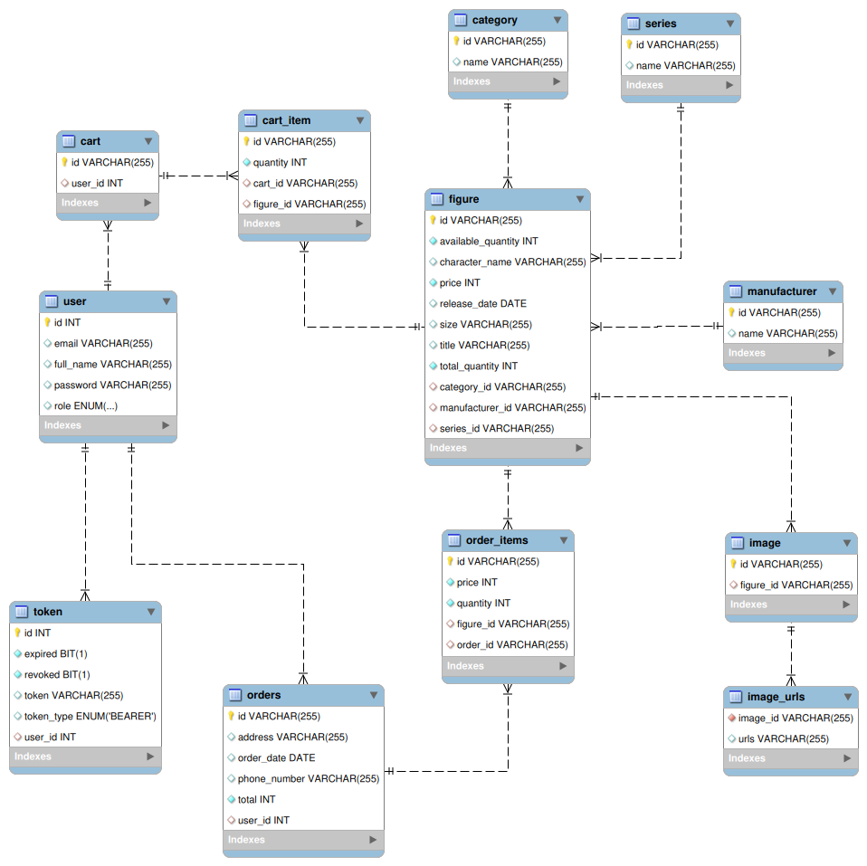

# Hoyoverse Figure

An E-commerce website for selling anime figure products.

## Getting Started

These instructions will give you a copy of the project up and running on
your local machine for development and testing purposes.

### Prerequisites

Requirements for the software and other tools to build, test and push

-   [nodejs](https://nodejs.org/en/download/)
-   [npm](https://docs.npmjs.com/downloading-and-installing-node-js-and-npm)
-   [java](https://www.oracle.com/java/technologies/downloads/)

### Installation

A step by step series of examples that tell you how to get a development
environment running

1. Clone the project

```bash
  git clone https://github.com/giahuyhw66715/Hoyoverse-Figure.git
```

2. Open Hoyoverse-Figure folder
3. Open Intellij and select Hoyoverse-Backend folder
4. Run docker from terminal

```bash
  docker-compose up -d
```

5. Find and copy script from database.sql to mysql workbench and execute it.

6. Hit the start button in Intellij

7. From Hoyoverse-Figure folder, go to frontend folder

```bash
  cd Hoyoverse-Frontend
```

7. Install dependencies

```bash
  npm install
```

8. Start the server

```bash
  npm run dev
```

9. Follow the link in terminal or enter http://localhost:5173/ in browser

## ER Diagram



## Demo

**Home Page**


**Figure Page**


**About Page**


**Admin Page**


**Cart Page**


**Order Page**


## Built With

-   [](https://katherineoelsner.com/)
-   [](https://twitter.com/)
-   [](https://www.linkedin.com/)
